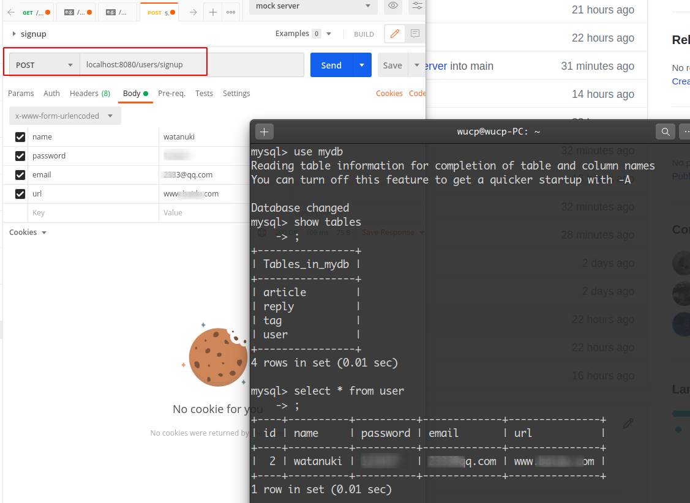
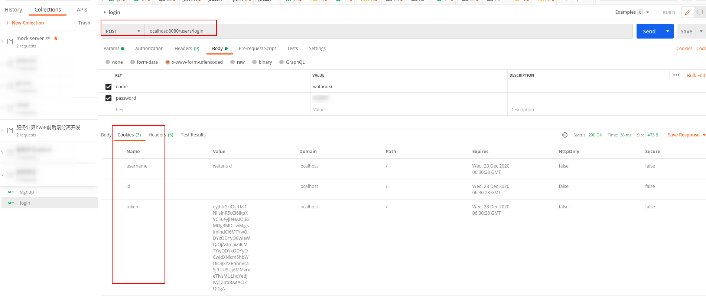

# server
the web server

## 关于测试

### 鉴权模块测试

对于鉴权模块来说，直接用postman和数据库、redis的效果查看测试结果远比用代码编写单元测试要直观有效。因此，鉴权模块使用postman做测试。

##### 注册接口：/users/signup

可见信息能够成功记录，注册成功。

##### 登录接口：/users/login

可见用户用相应的用户名和密码登录，能够成功响应，获取相应的cookie。查看redis也能确定多了一条token记录：

##### 登出接口：/users/logout

首先需要访问受限资源：

可见能够正常访问。然后携带cookie向localhost:8080/users/logout发get请求登出，再次试图访问受限资源:

显然，已经无法访问受限资源了。可见鉴权模块能够正常工作。