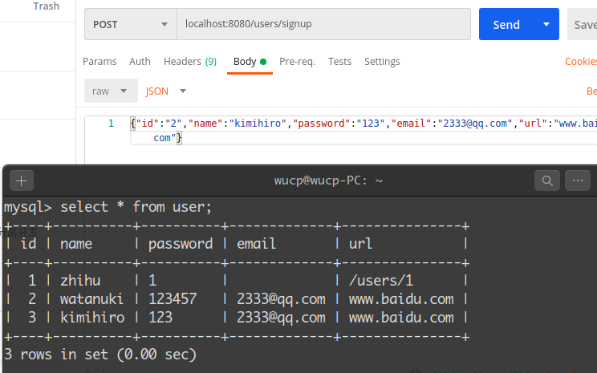
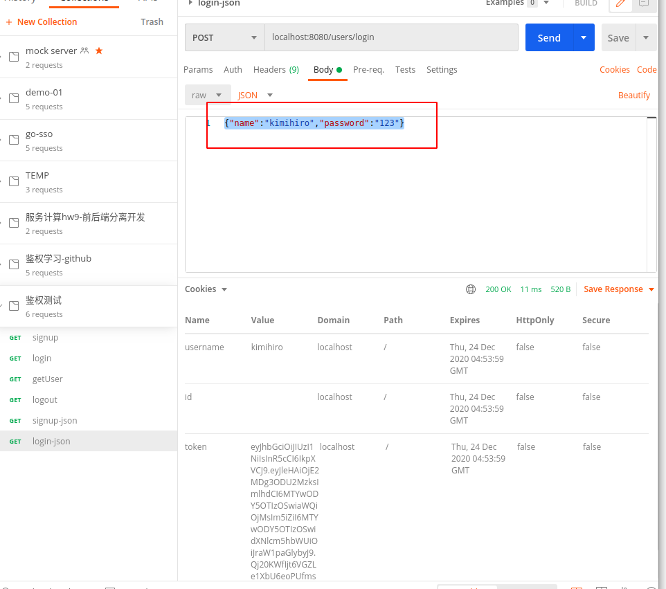
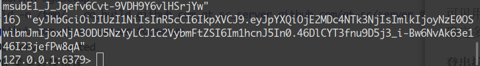
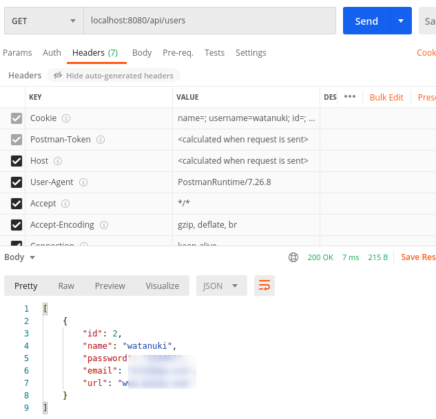
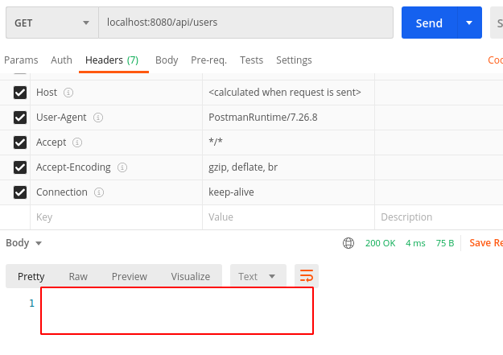

<!-- omit in toc -->
# back-end

the back end for zhihu_coffee


- [简介](#简介)
- [使用说明](#使用说明)
	- [部署MySql](#部署mysql)
	- [部署Redis](#部署redis)
	- [运行](#运行)
	- [docker打包镜像](#docker打包镜像)
	- [docker运行](#docker运行)
- [设计与功能](#设计与功能)
	- [数据库](#数据库)
	- [服务接口](#服务接口)
	- [数据获取脚本](#数据获取脚本)
	- [鉴权模块](#鉴权模块)
- [测试](#测试)
	- [鉴权模块测试](#鉴权模块测试)
		- [注册接口：/users/signup](#注册接口userssignup)
		- [登录接口：/users/login](#登录接口userslogin)
		- [登出接口：/users/logout](#登出接口userslogout)

## 简介

Zhihu-coffee后端基于Golang、MySql和Redis，可以部署到Windows、Linux和MacOS上，提供数据存储、知乎日报数据拉取、文章发布和分享功能。

## 使用说明

### 部署MySql

| 数据库参数名 | 参数      |
| ------------ | --------- |
| Name         | mydb      |
| Username     | root      |
| Password     | root      |
| Address      | localhost |
| Port         | 3306      |

注意：需要调整MySql的编码为utf8或utf8mb4以适应中文字符。

### 部署Redis

| 数据库参数名 | 参数           |
| ------------ | -------------- |
| Address      | localhost:6379 |
| Password     |                |
| DB           | 0              |

### 运行

```
go run main.go
```

### docker打包镜像

```
docker build -t server .
```

### docker运行

```
docker -d --name back-end --network host server:latest
```

## 设计与功能

### 数据库

数据库提供接口，对资源的 CRUD 操作；

```go
type DBServiceInterface interface {

	GetAllUser() ([]model.User, error)
	GetOneUser(string) (model.User, error)
	CreateUser(model.User) (bool, error)
	DeleteUser(int64) (bool, error)
	UpdateUser(model.User) (bool, error)

	GetAllArticle() ([]model.Article, error)
	GetArticleByUser(int64) ([]model.Article, error)
	GetArticleByTag(string) ([]model.Article, error)
	GetArticleByArticle(int64) (model.Article, error)
	CreateArticle(model.Article) (bool, error)
	DeleteArticle(int64) (bool, error)
	UpdateArticleLikeNum(int64, int64) (bool, error)
	UpdateArticleContent(int64, string) (bool, error)

	GetReply(int64) (model.Reply, error)
	GetReplyByArticle(int64) ([]model.Reply, error)
	CreateReply(model.Reply) (bool, error)
	UpdateReplyLikeNum(int64, int64) (bool, error)

	GetAllTag() ([]model.Tag, error)
	GetTagByArticle(int64) ([]model.Tag, error)
	CreateTag(model.Tag) (bool, error)
}
```

gorm 数据库操作

- `Find(&records)` 获取所有记录
- `Where("id = ?", id).First(&recode)` 结合where查询，获取首个符合条件记录
- `Create(&record)` 创建记录
- `Delete(&record, id)` 根据主键删除记录
- `Model(&record).Update(...)` 更新记录指定字段
- `Model(&master).Related(&slaves)` 根据主表记录获取从表记录，处理 `hasMany` 关系
- `Model(&left).Related(&right, ForeignKey)` 用连接表获取记录，处理 `many2many` 关系


### 服务接口

API 服务接口用于处理前端请求；

```go
//service/api_article.go
func CreateArticle(w http.ResponseWriter, r *http.Request) {...}
func DeleteArticle(w http.ResponseWriter, r *http.Request) {...}
func GetArticle(w http.ResponseWriter, r *http.Request) {...}
func GetArticles(w http.ResponseWriter, r *http.Request) {...}
func LikeArticle(w http.ResponseWriter, r *http.Request) {...}
func UpdateArticle(w http.ResponseWriter, r *http.Request) {...}

//service/api_default.go
func GetApis(w http.ResponseWriter, r *http.Request) {...}

//service/api_reply.go
func CreateReply(w http.ResponseWriter, r *http.Request) {...}
func GetReplies(w http.ResponseWriter, r *http.Request) {...}
func GetReply(w http.ResponseWriter, r *http.Request) {...}
func LikeReply(w http.ResponseWriter, r *http.Request) {...}

//service/api_tag.go
func CreateTag(w http.ResponseWriter, r *http.Request) {...}
func GetTags(w http.ResponseWriter, r *http.Request) {...}
func SearchArticlesByTag(w http.ResponseWriter, r *http.Request) {...}

//service/api_user.go
func DeleteUser(w http.ResponseWriter, r *http.Request) {...}
func GetUserInfo(w http.ResponseWriter, r *http.Request) {...}
func GetUsers(w http.ResponseWriter, r *http.Request) {...}
func UpdateUser(w http.ResponseWriter, r *http.Request) {...}
func UserLogin(w http.ResponseWriter, r *http.Request) {...}
func UserLogout(w http.ResponseWriter, r *http.Request) {..}
func UserSignup(w http.ResponseWriter, r *http.Request) {...}
```

从请求 `request` 中获取参数数据，然后进行诸如解析 url、解析 json 格式、调整数据类型等操作，再调用数据库接口获取数据或者将数据同步到数据库中，如果需要，将数据转换成 json 格式，返回给前端；

- 解析 url：字符串匹配，从 `.../xxxs/xxx_id/...` url 中获取指定资源 `xxx` 的标识 `xxx_id`

- 解析 json：调用 `json.Unmarshal` 将从请求中获取的 json 数据先转成字节流再转成对应资源 `xxx` 的结构体
- 转换 json：调用 `json.Marshal` 将资源 `xxx` 的结构体转成 json 数据


### 数据获取脚本


### 鉴权模块

1.使用通用的做法，前端向后端发送json数据，解码完成注册和登录。

2.使用中间件，思想类似java中的拦截器，所有应当鉴权的api都在中间件完成鉴权再执行逻辑处理函数，鉴权失败则返回。

3.使用白名单的机制存储token。即，每当用户登录时，颁发一个token，并把token以键值的方式存在redis，每当做token校验时，还需去redis查有没有这个token，有则有效。当用户登出时，从redis删除这个token。

为什么不考虑黑名单？因为黑名单是会膨胀的，而白名单始终存储当前有效的token，整体量不会很大。

## 测试

### 鉴权模块测试

对于鉴权模块来说，直接用postman和数据库、redis的效果查看测试结果远比用代码编写单元测试要直观有效。因此，鉴权模块使用postman做测试。

#### 注册接口：/users/signup

header中选择Content-Type为application/json，然后发送数据：



可见信息能够成功记录，注册成功。

#### 登录接口：/users/login



可见用户用相应的用户名和密码登录，能够成功响应，获取相应的cookie。查看redis也能确定多了一条token记录：



#### 登出接口：/users/logout

首先需要访问受限资源：



可见能够正常访问。然后携带cookie向localhost:8080/users/logout发get请求登出，再次试图访问受限资源:



显然，已经无法访问受限资源了。可见鉴权模块能够正常工作。
